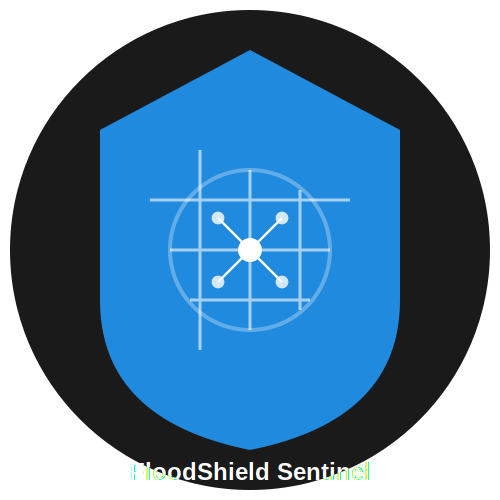

# 🛡️ FloodShield Sentinel 智能防汛预警系统



[](LICENSE)
[]()
[]()

## 📋 项目简介

FloodShield Sentinel 是一个基于 C++ 开发的智能网络流量监控与分析系统，专门用于检测和防御网络攻击。本系统采用 libpcap 进行底层数据包捕获，实现实时流量分析和异常检测。

### 🎯 主要特点
- 实时网络流量监控
- TCP/UDP 协议分析
- 智能异常流量检测
- 多网卡接口支持
- 终端可视化显示

## 💡 核心功能

### 1. 网络监控 📊
- 实时数据包捕获
- 协议类型识别（TCP/UDP）
- 端口流量统计
- IP 流量分析

### 2. 异常检测 🚨
- DDoS 攻击检测
- 流量突发预警
- 异常连接监控
- 实时告警提示

### 3. 数据分析 📈
- 流量统计分析
- 连接状态跟踪
- 实时流量图表
- 网络性能监控

## 🔧 技术架构

### 开发环境
- C++ 17
- libpcap
- ANSI Terminal UI

### 系统要求
- MacOS/Linux 操作系统
- 管理员/Root 权限
- 支持 libpcap 的网络接口

## 📌 编译要求

### 依赖项
- g++ 编译器 (支持 C++17)
- libpcap 开发库
- make 工具

### 硬件要求

- CPU: 双核处理器或更高
- 内存: 最少 4GB RAM
- 网卡: 支持混杂模式的网络接口
- 存储: 最少 1GB 可用空间

### 软件环境

- 操作系统:
  - MacOS 10.15+ (Catalina or later)
  - Ubuntu 20.04 LTS+
  - CentOS 8+
- 编译器: g++ 8.0+ 或 clang++ 10.0+
- libpcap: 1.9.0+
- make: 3.8+

### 网络要求

- 支持的网络接口类型:
  - en0: 以太网/Wi-Fi 接口
  - lo0: 本地环回接口
  - awdl0: 苹果无线直连接口
  - bridge0: 网桥接口
  - utun[0-9]: VPN/隧道接口
- 网络接口必须支持混杂模式
- 建议使用有线网络接口以获得最佳性能


### MacOS 环境配置
```bash
brew install libpcap
````

### Linux 环境配置

```bash
sudo apt-get install libpcap-dev  # Ubuntu/Debian
sudo yum install libpcap-devel    # CentOS/RHEL
```

## 🚀 快速开始

### 编译安装

1. 克隆代码仓库

```bash
git clone https://github.com/ctkqiang/floodshield-sentinel.git

或

git clone https://gitcode.com/ctkqiang_sr/floodshield-sentinel.git

cd floodshield-sentinel
```

2. 编译项目

```bash
make
```

3. 运行程序（需要管理员权限）

```bash
sudo ./kanghongweishi
```

### 使用说明

1. 启动后选择要监控的网络接口
2. 程序将显示实时网络流量信息
3. 根据流量异常程度显示不同级别的警告
4. 按 Ctrl+C 退出程序

## 📖 功能说明

- 🟢 正常流量: < 10 packets/sec
- 🟡 警告流量: > 10 packets/sec
- 🔴 危险流量: > 100 packets/sec

## 📸 运行演示

### 网络接口选择


```bash
选择监听的网络接口 (Select Network Interface):

1: ap1 [无线接入点]
2: en0 [以太网/Wi-Fi 接口]
3: awdl0 [苹果无线直连接口]
4: llw0 [低延迟无线局域网]
5: utun0 [VPN/隧道接口 0]
6: utun1 [VPN/隧道接口]
7: utun2 [VPN/隧道接口]
8: utun3 [VPN/隧道接口]
9: utun4 [VPN/隧道接口]
10: utun5 [VPN/隧道接口]
11: lo0 [本地环回接口]
12: anpi0 [锚点网络接口]
13: anpi1 [锚点网络接口]
14: en3 [以太网接口]
15: en4 [以太网接口]
16: en1 [以太网接口]
17: en2 [以太网接口]
18: bridge0 [网桥接口]
19: gif0 [通用隧道接口]
20: stf0 [IPv6 隧道接口]

```

# 实时流量监控

```bash
🛡️ 正在监听 en0 上的流量...
📦 192.168.1.100 ➜ 192.168.1.1 | TCP 443➜62091
📦 71.18.1.198 ➜ 192.168.100.142 | TCP 443➜62092
...
```


## 🤝 贡献指南

欢迎提交 Pull Request 或 Issue。

## 许可证

本项目采用 **木兰宽松许可证 (Mulan PSL)** 进行许可。  
有关详细信息，请参阅 [LICENSE](LICENSE) 文件。  
（魔法契约要保管好哟~）

[](http://license.coscl.org.cn/MulanPSL2)

## 🌟 开源项目赞助计划

### 用捐赠助力发展

感谢您使用本项目！您的支持是开源持续发展的核心动力。  
每一份捐赠都将直接用于：  
✅ 服务器与基础设施维护（魔法城堡的维修费哟~）  
✅ 新功能开发与版本迭代（魔法技能树要升级哒~）  
✅ 文档优化与社区建设（魔法图书馆要扩建呀~）

点滴支持皆能汇聚成海，让我们共同打造更强大的开源工具！  
（小仙子们在向你比心哟~）

---

### 🌐 全球捐赠通道

#### 国内用户

<div align="center" style="margin: 40px 0">

<div align="center">
<table>
<tr>
<td align="center" width="300">

<br />
<strong>🔵 支付宝</strong>（小企鹅在收金币哟~）
</td>
<td align="center" width="300">

<br />
<strong>🟢 微信支付</strong>（小绿龙在收金币哟~）
</td>
</tr>
</table>
</div>
</div>

#### 国际用户

<div align="center" style="margin: 40px 0">
  <a href="https://qr.alipay.com/fkx19369scgxdrkv8mxso92" target="_blank">
    
  </a>
  
  <a href="https://ko-fi.com/F1F5VCZJU" target="_blank">
    
  </a>
  
  <a href="https://www.paypal.com/paypalme/ctkqiang" target="_blank">
    
  </a>
  
  <a href="https://donate.stripe.com/00gg2nefu6TK1LqeUY" target="_blank">
    
  </a>
</div>

---

### 📌 开发者社交图谱

#### 技术交流

<div align="center" style="margin: 20px 0">
  <a href="https://github.com/ctkqiang" target="_blank">
    
  </a>
  
  <a href="https://stackoverflow.com/users/10758321/%e9%92%9f%e6%99%ba%e5%bc%ba" target="_blank">
    
  </a>
  
  <a href="https://www.linkedin.com/in/ctkqiang/" target="_blank">
    
  </a>
</div>

#### 社交互动

<div align="center" style="margin: 20px 0">
  <a href="https://www.instagram.com/ctkqiang" target="_blank">
    
  </a>
  
  <a href="https://twitch.tv/ctkqiang" target="_blank">
    
  </a>
  
  <a href="https://github.com/ctkqiang/ctkqiang/blob/main/assets/IMG_9245.JPG?raw=true" target="_blank">
    
  </a>
</div>
